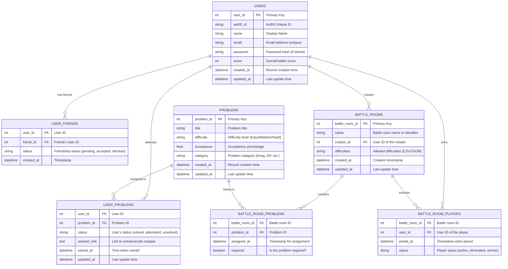

# LeetBattle API Documentation

**Version:** 1.0  
**Last Updated:** April 5th 2025

## Overview

This API provides endpoints to manage the main entities in our battle/competition system. The core entities include:

- **Users** – Participants in the battles.
- **User Friends** – Relationships between users.
- **Problems** – Challenges or questions in the system.
- **User Problems** – Tracking a user’s progress on problems.
- **Battle Rooms** – Sessions or battles where users compete.
- **Battle Room Problems** – Linking problems to specific battle rooms.
- **Battle Room Players** – Associating users with battle rooms.

All endpoints return JSON responses and use standard HTTP status codes to indicate success or error conditions.

## Table of Contents

1. [Users Endpoints](#users-endpoints)
2. [User Friends Endpoints](#user-friends-endpoints)
3. [Problems Endpoints](#problems-endpoints)
4. [User Problems Endpoints](#user-problems-endpoints)
5. [Battle Rooms Endpoints](#battle-rooms-endpoints)
6. [Battle Room Problems Endpoints](#battle-room-problems-endpoints)
7. [Battle Room Players Endpoints](#battle-room-players-endpoints)

---

## 1. Users Endpoints

### GET /users

- **Description:** Retrieve a list of all users.
- **Response:**
  - **200 OK** – A JSON array of user objects.
- **Example Response:**

```json
[
  {
    "user_id": 1,
    "auth0_id": "auth0|12345",
    "name": "Alice Smith",
    "email": "alice@example.com",
    "score": 100,
    "created_at": "2025-04-01T12:00:00Z",
    "updated_at": "2025-04-03T15:00:00Z"
  },
  {
    "user_id": 2,
    "auth0_id": "auth0|67890",
    "name": "Bob Johnson",
    "email": "bob@example.com",
    "score": 80,
    "created_at": "2025-04-02T10:30:00Z",
    "updated_at": "2025-04-04T08:45:00Z"
  }
]
```

### GET /users/{user_id}

- **Description:** Retrieve details of a specific user by user ID.
- **Response:**
  - **200 OK** – A JSON object representing the user.
  - **404 Not Found** – If the user does not exist.
- **Example Response:**

```json
{
  "user_id": 1,
  "auth0_id": "auth0|12345",
  "name": "Alice Smith",
  "email": "alice@example.com",
  "score": 100,
  "created_at": "2025-04-01T12:00:00Z",
  "updated_at": "2025-04-03T15:00:00Z"
}
```

### POST /users

- **Description:** Create a new user.
- **Request Body:**

```json
{
  "auth0_id": "auth0|12345",
  "name": "Alice Smith",
  "email": "alice@example.com",
  "score": 0,
  "created_at": "2025-04-01T12:00:00Z",
  "updated_at": "2025-04-01T12:00:00Z"
}
```

- **Response:**
  - **201 Created** – Returns the created user object.
- **Example Response:**

```json
{
  "user_id": 1,
  "auth0_id": "auth0|12345",
  "name": "Alice Smith",
  "email": "alice@example.com",
  "score": 0,
  "created_at": "2025-04-01T12:00:00Z",
  "updated_at": "2025-04-01T12:00:00Z"
}
```

### PUT /users/{user_id}

- **Description:** Update an existing user's details.
- **Request Body:** (Partial or full user object)

```json
{
  "name": "Alice B. Smith",
  "score": 110,
  "updated_at": "2025-04-04T10:00:00Z"
}
```

- **Response:**
  - **200 OK** – Returns the updated user object.
  - **404 Not Found** – If the user does not exist.

### DELETE /users/{user_id}

- **Description:** Delete a user by user ID.
- **Response:**
  - **200 OK** – Confirmation message.
  - **404 Not Found** – If the user does not exist.

---

## 2. User Friends Endpoints

### GET /users/{user_id}/friends

- **Description:** Retrieve the friend list for a specific user.
- **Response:**
  - **200 OK** – A JSON array of friend relationship objects.
- **Example Response:**

```json
[
  {
    "user_id": 1,
    "friend_id": 2,
    "status": "accepted",
    "created_at": "2025-04-02T09:00:00Z"
  }
]
```

### POST /users/{user_id}/friends

- **Description:** Add a friend for a user.
- **Request Body:**

```json
{
  "friend_id": 2,
  "status": "pending",
  "created_at": "2025-04-03T11:00:00Z"
}
```

- **Response:**
  - **201 Created** – Returns the created friend relationship object.

---

## 3. Problems Endpoints

### GET /problems

- **Description:** Retrieve a list of all problems.
- **Response:**
  - **200 OK** – A JSON array of problem objects.
- **Example Response:**

```json
[
  {
    "problem_id": 1,
    "title": "Two Sum",
    "difficulty": "Easy",
    "acceptance": 75.5,
    "category": "Array",
    "created_at": "2025-04-01T08:00:00Z",
    "updated_at": "2025-04-01T08:00:00Z"
  }
]
```

### GET /problems/{problem_id}

- **Description:** Retrieve details of a specific problem.
- **Response:**
  - **200 OK** – Returns the problem object.
  - **404 Not Found** – If the problem does not exist.

### POST /problems

- **Description:** Create a new problem.
- **Request Body:**

```json
{
  "title": "Two Sum",
  "difficulty": "Easy",
  "acceptance": 75.5,
  "category": "Array",
  "created_at": "2025-04-01T08:00:00Z",
  "updated_at": "2025-04-01T08:00:00Z"
}
```

- **Response:**
  - **201 Created** – Returns the created problem object.

### PUT /problems/{problem_id}

- **Description:** Update an existing problem.
- **Request Body:** (Partial or full problem object)
- **Response:**
  - **200 OK** – Returns the updated problem object.
  - **404 Not Found** – If the problem does not exist.

### DELETE /problems/{problem_id}

- **Description:** Delete a problem.
- **Response:**
  - **200 OK** – Confirmation message.
  - **404 Not Found** – If the problem does not exist.

---

## 4. User Problems Endpoints

### GET /users/{user_id}/problems

- **Description:** Retrieve all problem records for a user.
- **Response:**
  - **200 OK** – A JSON array of user-problem records.
- **Example Response:**

```json
[
  {
    "user_id": 1,
    "problem_id": 1,
    "status": "solved",
    "solution_link": "https://github.com/alice/iPhone-solution",
    "solved_at": "2025-04-05T14:00:00Z",
    "updated_at": "2025-04-05T14:00:00Z"
  }
]
```

### POST /users/{user_id}/problems

- **Description:** Create a new record for a user's attempt at a problem.
- **Request Body:**

```json
{
  "problem_id": 1,
  "status": "attempted",
  "solution_link": "",
  "solved_at": null,
  "updated_at": "2025-04-05T12:00:00Z"
}
```

- **Response:**
  - **201 Created** – Returns the created record.

### PUT /users/{user_id}/problems/{problem_id}

- **Description:** Update a specific user-problem record.
- **Request Body:** (Partial update)
- **Response:**
  - **200 OK** – Returns the updated record.
  - **404 Not Found** – If the record does not exist.

### DELETE /users/{user_id}/problems/{problem_id}

- **Description:** Delete a specific user-problem record.
- **Response:**
  - **200 OK** – Confirmation message.

---

## 5. Battle Rooms Endpoints

### GET /battle_rooms

- **Description:** Retrieve all battle rooms.
- **Response:**
  - **200 OK** – A JSON array of battle room objects.

### GET /battle_rooms/{battle_room_id}

- **Description:** Retrieve details of a specific battle room.
- **Response:**
  - **200 OK** – Returns the battle room object.
  - **404 Not Found** – If the battle room does not exist.

### POST /battle_rooms

- **Description:** Create a new battle room.
- **Request Body:**

```json
{
  "name": "Spring Challenge",
  "creator_id": 1,
  "difficulties": "Easy,Medium,Hard",
  "created_at": "2025-04-03T09:00:00Z",
  "updated_at": "2025-04-03T09:00:00Z"
}
```

- **Response:**
  - **201 Created** – Returns the created battle room object.

### PUT /battle_rooms/{battle_room_id}

- **Description:** Update a battle room.
- **Request Body:** (Partial update)
- **Response:**
  - **200 OK** – Returns the updated battle room object.
  - **404 Not Found** – If the battle room does not exist.

### DELETE /battle_rooms/{battle_room_id}

- **Description:** Delete a battle room.
- **Response:**
  - **200 OK** – Confirmation message.
  - **404 Not Found** – If the battle room does not exist.

---

## 6. Battle Room Problems Endpoints

### GET /battle_rooms/{battle_room_id}/problems

- **Description:** Retrieve all problems assigned to a specific battle room.
- **Response:**
  - **200 OK** – A JSON array of battle room problem records.
- **Example Response:**

```json
[
  {
    "battle_room_id": 1,
    "problem_id": 1,
    "assigned_at": "2025-04-03T10:00:00Z",
    "required": true
  }
]
```

### POST /battle_rooms/{battle_room_id}/problems

- **Description:** Assign a new problem to a battle room.
- **Request Body:**

```json
{
  "problem_id": 2,
  "assigned_at": "2025-04-03T10:30:00Z",
  "required": false
}
```

- **Response:**
  - **201 Created** – Returns the created record.

### DELETE /battle_rooms/{battle_room_id}/problems/{problem_id}

- **Description:** Remove a problem assignment from a battle room.
- **Response:**
  - **200 OK** – Confirmation message.
  - **404 Not Found** – If the record does not exist.

---

## 7. Battle Room Players Endpoints

### GET /battle_rooms/{battle_room_id}/players

- **Description:** Retrieve all players in a battle room.
- **Response:**
  - **200 OK** – A JSON array of battle room player records.
- **Example Response:**

```json
[
  {
    "battle_room_id": 1,
    "user_id": 1,
    "joined_at": "2025-04-03T09:30:00Z",
    "status": "active"
  }
]
```

### POST /battle_rooms/{battle_room_id}/players

- **Description:** Add a player to a battle room.
- **Request Body:**

```json
{
  "user_id": 2,
  "joined_at": "2025-04-03T09:45:00Z",
  "status": "active"
}
```

- **Response:**
  - **201 Created** – Returns the created record.

### PUT /battle_rooms/{battle_room_id}/players/{user_id}

- **Description:** Update a player’s status in a battle room.
- **Request Body:** (Partial update)

```json
{
  "status": "eliminated"
}
```

- **Response:**
  - **200 OK** – Returns the updated record.
  - **404 Not Found** – If the record does not exist.

### DELETE /battle_rooms/{battle_room_id}/players/{user_id}

- **Description:** Remove a player from a battle room.
- **Response:**
  - **200 OK** – Confirmation message.
  - **404 Not Found** – If the record does not exist.

---

## Additional Notes

- **Authentication & Authorization:**  
  These endpoints should be secured. Consider implementing authentication (e.g., via JWT or OAuth) to protect endpoints.

- **Validation:**  
  Input data should be validated. Schema validation (e.g., with JSON Schema) can help ensure that incoming data is well-formed.

- **Pagination & Filtering:**  
  For endpoints returning lists (e.g., GET /users, GET /problems), consider implementing pagination, filtering, and sorting to handle large datasets.

- **Error Handling:**  
  Standard error responses should be provided in JSON format with meaningful error messages and HTTP status codes.

---

## Entity Relationship Diagram


